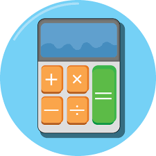

#  Calculator 🧮
 This is a simple command-line calculator program written in Python. It allows users to perform basic arithmetic operations such as addition, subtraction, multiplication, and division on two numbers. The calculator also supports a continuous calculation feature, which means you can perform multiple calculations in succession without restarting the program.



## Features

✨ Addition (+)

✨ Subtraction (-)

✨ Multiplication (*)

✨ Division (/)

✨ Continuous calculation

✨ User-friendly command-line interface

✨ Easy-to-understand operation symbols

## How to Use
1. Run the calculator program in your Python environment.

```python
python calculator.py
```

2. Enter the first number when prompted.

3. Select the desired operation by typing the corresponding symbol ('+', '-', '*', or '/').

4. Enter the second number.

5. The calculator will display the result of the operation.

6. You can choose to continue calculating with the result, exit the program, or start over.

- To continue with the result, type 'y'.
- To exit the program and see the final answer, type 'e'.
- To start a new calculation from scratch, type 'n'.

## Example Usage
Let's say you want to calculate 10 + 5:

1. Enter the first number: `10`
2. Select the operation: `+`
3. Enter the second number: `5`

The calculator will display:

```
10 + 5 = 15

Type "y" to continue calculating with 15 or type "e" to exit or "n" to start over:
```

You can then choose to continue with the result or perform another calculation.

## Author

👤 Maham Jamil

## 📧 Contact

[GitHub repository](https://github.com/Maham-j)

 [LinkedIn](https://www.linkedin.com/in/maham-jamil-268584267)

 [HackerRank ](https://www.hackerrank.com/maham_jamil)


## License
This project is open-source and available under the [GNU General Public License v3.0](LICENSE). Feel free to use and modify the code as needed. If you make any significant improvements or modifications, consider contributing them back to the project.

Enjoy calculating with your new Python calculator! 🚀
